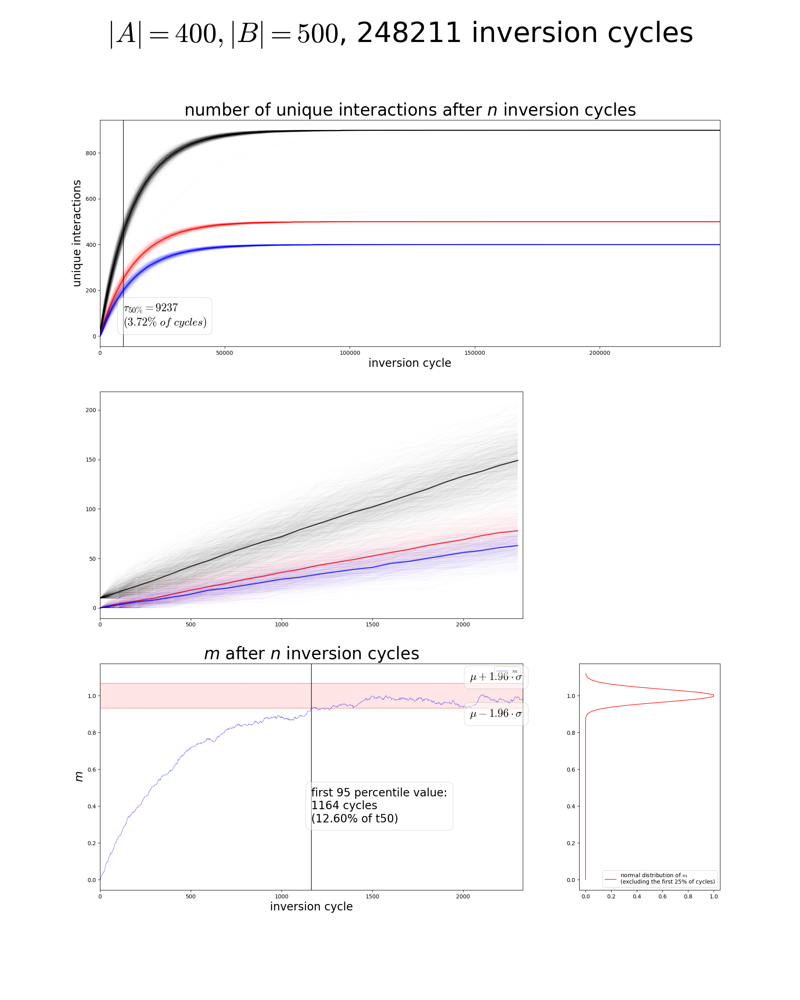

# chromsim

## Running the program

Make sure that the necessary Python modules are available and execute the following command:

`inversion_sim/main.py [-h] <-C | -c CYCLE_NUMBER> [-w WINDOW_SIZE {1}] [-l LEVEL_OF_CONVERGENCE {1}] [-T] [-t TRANSLOCATIONS_PER_CYCLE {0}] [-o OUTPUT_DIR {"./"}] A_SIZE B_SIZE`

### Parameters

- `-h, --help`: Show detailed help.
- `-C, --converge`: Let the simulation run until all genes are converged (i.e. all possible interactions between any two genes have been explored).
- `-c, --cycle-number`: Let the simulation run for CYCLE_NUMBER cycles, regardless of when convergence is reached. Note that, if CYCLE_NUMBER is low, $\tau_{50\\%}$ and the `converged_at` values will return as `-1`.
- `-w, --window-size`: Specify the distance over which two genes are said to be able to interact.
- `-l, --level-of-convergence`: Specify the fraction of possible interactions to be explored when `-C` is set.
- `-T, --plot-average-t50`: If this flag is set, the program will plot the average $\tau_{50\\%}$ of previous runs (reading the data from log files), then exit (not running a simulation).
- `-t, --translocations-per-cycle`: Specify the number of genes to randomly move to a different position each cycle (in addition to inversion).
- `-o, --output-dir`: Set the directory to use as the basis for all file-based actions. If not present, `log/` and `diagrams/` subfolders will be created there.
- `A_SIZE, B_SIZE`: Set the number of genes in each ancestral group.

## Output

### Plots

Plots are stored in the folder `diagrams/`. They are available as PDF and PNG (in the subfolders `pdf/` and `png/`, respectively), and named in the format `inversion_sim_A(A_SIZE)-B(B_SIZE)_l(LEVEL_OF_CONVERGENCE)_w(WINDOW_SIZE)_c` (the final `_c` is omitted if a number of cycles was specified instead of `-C` when running). Dumping data into a YAML file is implemented but disabled at the moment due to its impact on runtime.

A plot contains the following subplots:

- a graph tracing the (cumulative) new unique interaction seen after each inversion cycle (for A genes with B genes, B genes with A genes, and overall)
- the same graph, but trimmed down to the x-axis range used for the $m$ plot (see below)
- a graph showing the $m$ value (see the [Schultz et al. 2023 paper](https://www.nature.com/articles/s41586-023-05936-6), supplementary information section 13 for more information) from the start until two times the number of cycles needed to reach the symmetrical 95% interval of the $m$ value normal distribution (see below)
- a normal distribution of $m$ after a 25% burn-in

*example of a diagram file*
