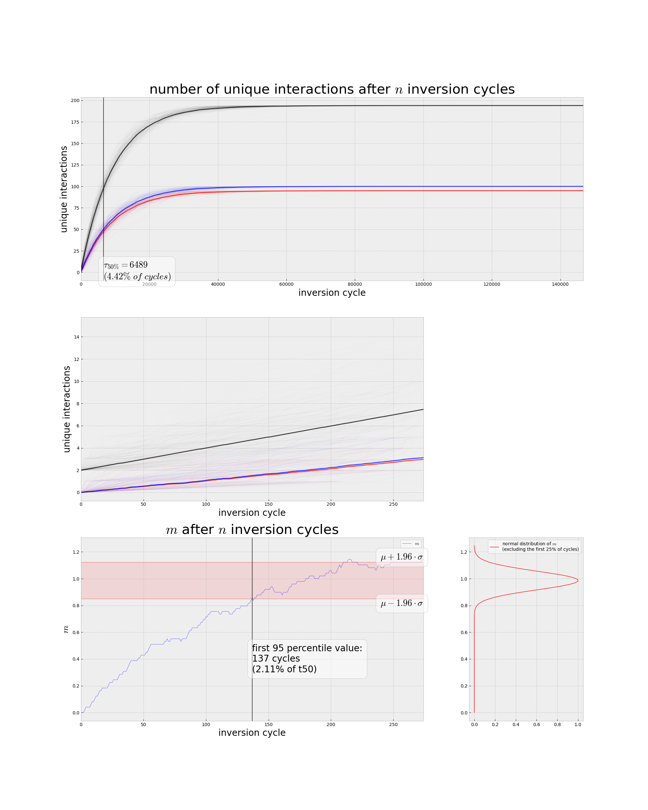
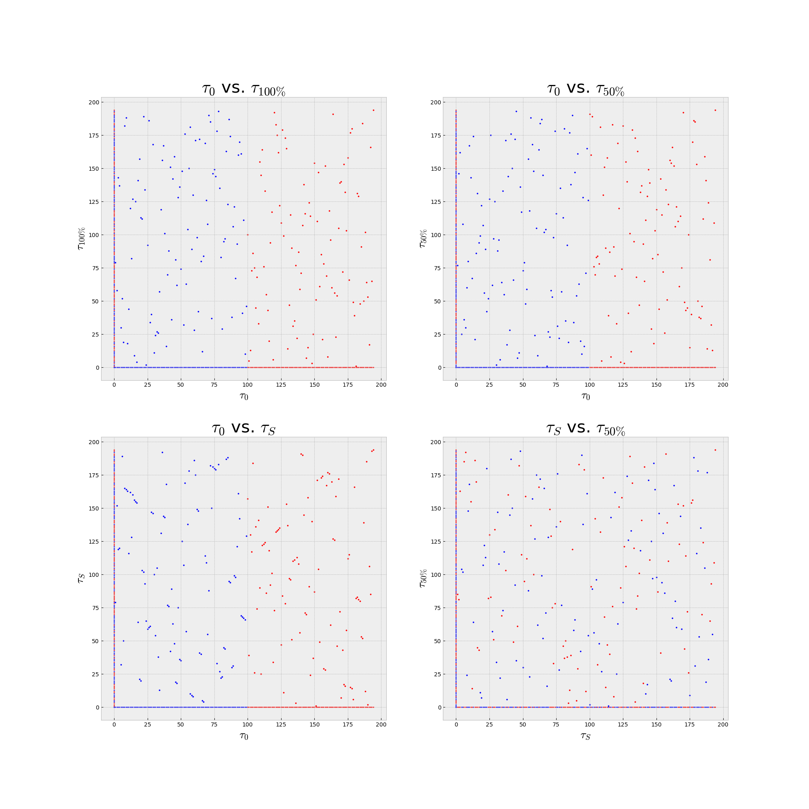

chromsim
========

The purpose of chromsim is to simulate inversion events on a single (simplified) chromosome in order to to analyze its entropic behavior (for the definition of this gene mixing entropy, see [Schultz, D.T., et al. (2023)](https://www.nature.com/articles/s41586-023-05936-6), Supplementary Information p.81) over time in a fusion-with-mixing (FWM) scenario. Such a chromosome consists of equidistant genes assigned to two linkage groups (LGs) **A** and **B**. Initially, the two groups are cleanly separated (emulating the situation after a recent fusion or translocation event), before a series of random inversions are performed. Through this process, it is possible to estimate how many inversions it would take to reach a certain entropy value observed in reality. In addition to simulating a single chromosome's fate and plotting it, chromsim also offers the ability to collate the results for many runs and calculate averages or compare the behvaior under different parameter sets.

# Dependencies

chromsim requires your Python version to be 3.10 or later. Please make sure you have the following Python packages available on your system:

- `numpy`
- `scipy`
- `pandas`
- `matplotlib`

# Usage

(Shell scripts showcasing the functionalities below can be found under `example_scripts/`.)

## General-purpose parameters

A handful of arguments apply to all or most uses for this program. These are:

- `-o/--output-dir some/output/directory/`: the directory in which any produced files are saved (uses the present working directory if omitted)
- `-f/--filename my_output`: the name (without a file ending) of the produced file in cases where only one output file is produced (defaults to using a timestamp if not specified)

## Running a simulation

To simulate a series of random inversions, run the script `main.py` with the argument `-S/--simulate`. This requires the additional arguments `-a/--asize A` (`A` is the number of genes in the first linkage group), `-b/--bsize B` (same thing for the second linkage group) in any case. This produces a `.inv` file containing all the information needed to reproduce the run (for instance for plotting it, see below). A command and the resulting file might look like this (for the additional parameters, see the other sections of this document):

```
> path/to/main.py -S -a 100 -b 95 -w 1 -f example
```

```
# timestamp 2024-03-18 15:54:46.171033
## params
# Asize 100
# Bsize 95
# window_size 1
# level_of_convergence 1.00
## results
# t100 146669
# t50 6489
# tS 137
# mu 0.99
# sigma 0.07
# AB_convergence 146669

6	90
114	155
34	106
59	142
45	118
.
.
.
```

The recorded results are:

- `t100` (τ<sub>100</sub>): the number of inversion cycles until convergence (i.e. the total number of cycles in a "normal" run with no meddling options)
- `t50` (τ<sub>50</sub>): the number of cycles by which 50% of all possible gene pairings have been recorded
- `tS` (τ<sub>S</sub>): the number of cycles until the first entropy value within the 1.96σ of μ was recorded
- `mu` (μ): the arithmetic mean of the entropy values at each cycle (after a 25% burn-in)
- `sigma` (σ): the standard deviation of the entropy values at each cycle (after a 25% burn-in)
- `AB_convergence`: the number of cycles it took for each gene in group A to have interacted with each gene in group B and vice versa (though not necessarily with each gene in its own group)

followed by a list of positions of the cuts made for each inversion. For each inversion, two positions on the chromosomes are randomly chosen, and the sequence of genes between them gets inverted.

### Optional parameters
 
If you want to specify a window size (the distance along the chromosome to the left and right of a gene that are counted towards its new interactions after every iteration), you can do so by using `-w/--window-size W`. Otherwise, a default value of `W=1` will be used. If `-n/--cycle-number N` is used, only `N` inversion cycles will be simulated before exiting. Otherwise the simulation will run until all genes have converged (been within `W` of every other gene at least once over the course of the simulation). Similarly, by using `-l/--level-of-convergence L`, the simulation will stop once a fraction of all possible unique interactions between two genes equal to `L` has been recorded (`L` has to be within [0, 1], of course). `L=1` equates to omitting this option entirely.

### Using a `.rbh` file as a basis
 
chromsim accepts a `.rbh` file as input using the option `-r/--rbh path/to/file.rbh`. Instead of passing the A and B sizes using the above options, you will need to specify the linkage groups' names using `-A/--group-a ALG_A` and `-B/--group-b ALG_B`, respectively. Additionally, the program expects the name of the chromosome or scaffold with `-c/--chromosome CHROM`. The optional parameters above still apply. In addition, you have the option to only run the simulation until the entropy value calculated from the gene positions in the `.rbh` file has been reached. To do so, add the flag `-M/--find-m` to the execution command. If this flag is used, a line will be written to a file with the ending `.mc` containing information about the FWM event and how long it took to get there in the simulation. After a few simulations for different FMW events from a file `example.rbh`

```
> main.py -S -r path/to/example.rbh -A B1 -B B2 -c HVU7 -M
> main.py -S -r path/to/example.rbh -A B1 -B B2 -c RES4 -M
> main.py -S -r path/to/example.rbh -A A1b -B B3 -c RES13 -M
> main.py -S -r path/to/example.rbh -A A1b -B B3 -c HVU8 -M
.
.
.
```

the resulting tab-separated `example.mc` would look like this:

```
# path/to/example.rbh

fwm_event organism scaf  Asize Bsize m     cycles
B1(x)B2   HVU      HVU7  195   132   1.049 1486
B1(x)B2   RES      RES4  258   147   0.863 352
A1b(x)B3  RES      RES13 60    174   0.939 334
A1b(x)B3  HVU      HVU8  42    153   1.192 25868
.
.
.
```
 
## Plotting results
 
Runs can be plotted using the `-P` option instead of `-S`. This requires the name of the source `.inv` file using `-s/--source path/to/file.inv`. The output are four files: a figure with graphs tracing gene interaction counts and entropy over the simulation's course, and an of dotplots that compare the state at τ<sub>S</sub>, τ<sub>50</sub>, and τ<sub>100</sub> to the initial state and to each other. Both these images are supplied as `.png` and `.pdf`, and named like the source file with `_trace` and `_dotplots` added, respectively. To plot the results recorded in `example.inv`, the command

```
> main.py -P -s path/to/example.inv
```

would produce the following images:




### Generating an animated dotplot

If the flag `-G/--gif` is set, the program also generates an animated `.gif` file of the dotplot start vs. current after every inversion. The size is limited to 1000 frames. If more than 1000 steps are needed to complete the simulation, only every `cycle_number/1000`th step is represented. This flag increases the runtime considerably if used.


## Comparing runs

In order to draw meaningful conclusions, it is necessary to have more than one datapoint. To that end, chromsim can collect relevant data about τ<sub>50</sub> and τ<sub>S</sub> from all `.inv` files in a directory into a `.minv` file using the option `-m/--collect-minv`. In the same vein, `-p/--plot-minv` can be used to plot the average values as a function of chromosome size. For a file `averages.minv`

```
## Asize:45 Bsize:55 window:2
n=11
tS_avg=84.18181818181819
tS_stdev=32.25697438840498
tS_median=74.0
tS_q1=63.5
tS_q3=88.0
tS_min=50
tS_max=153
t50_avg=549.8181818181819
t50_stdev=8.199979842748858
t50_median=549.0
t50_q1=546.5
t50_q3=555.0
t50_min=536
t50_max=564

## Asize:4 Bsize:6 window:1
n=11
tS_avg=4.0
tS_stdev=3.6181361349331636
tS_median=3.0
tS_q1=1.0
tS_q3=5.5
tS_min=1
tS_max=13
t50_avg=12.636363636363637
t50_stdev=2.384523099746182
t50_median=12.0
t50_q1=10.5
t50_q3=14.5
t50_min=10
t50_max=17
.
.
.
```

a resulting pair of graphs looks like this:


The commands used to produce these are

```
> main.py -m --filename averages
> main.py -p --filename averages
```

# Citing chromsim

If you use `chromsim` in your work, please cite the following paper:

> Schultz, D.T., Blümel, A., Destanović, D., Sarigol, F., & Simakov, O. (2024).
> Topological mixing and irreversibility in animal chromosome evolution.
> *bioRxiv*, 2024.07.29.605683. [https://doi.org/10.1101/2024.07.29.605683](https://doi.org/10.1101/2024.07.29.605683)
